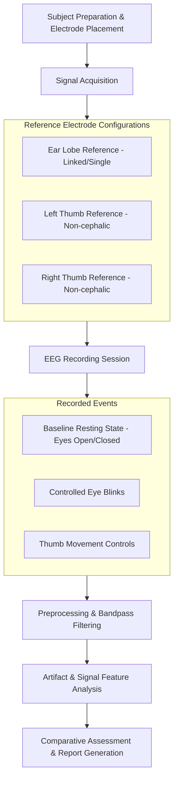
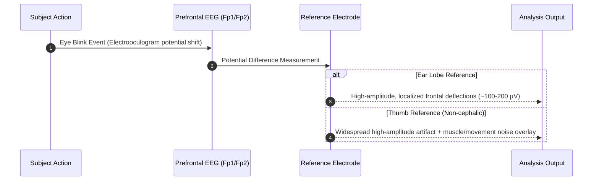

# EEG Data Practical Report: Eye Blink Artifacts & Reference Electrode Effects

## Executive Summary
This report presents an experimental analysis of Electroencephalography (EEG) data recorded during controlled motor and visual tasks. The primary objective is to investigate the influence of different reference electrode placements—specifically **Ear Lobe**, **Left Thumb**, and **Right Thumb**—on signal quality, noise characteristics, and the magnitude/propagation of **Eye Blink Artifacts**.

---

## Experimental Protocol & Signal Flow

---

## Key Experimental Conditions & Findings

### 1. Reference Electrode Effects
* **Ear Lobe (A1/A2):**
  * **Characteristics:** Standard cephalic/near-cephalic reference.
  * **Impact:** Minimal ECG/EMG contamination. High signal-to-noise ratio (SNR) for cortical potential mapping.
* **Left Thumb & Right Thumb:**
  * **Characteristics:** Non-cephalic limb references.
  * **Impact:** Increased vulnerability to movement artifacts, electromyographic (EMG) noise from hand muscle contraction, and cardiac interferences (ECG artifact spikes). Demonstrates the critical necessity of cephalic grounding in motor task monitoring.

---

### 2. Eye Blink Artifact Dynamics

---

## Signal Processing Pipeline

1. **Bandpass Filtering:** $0.5 \text{ Hz} - 45 \text{ Hz}$ zero-phase Butterworth filter to eliminate baseline drift and high-frequency noise.
2. **Notch Filtering:** $50 \text{ Hz} / 60 \text{ Hz}$ line-noise suppression.
3. **Artifact Detection:** Threshold peak detection and Independent Component Analysis (ICA) decomposition to isolate ocular components.

---

## Conclusion & Recommendations
* **Ear Lobe** reference remains the most stable setup for reducing non-cephalic noise during EEG acquisition.
* **Thumb References** introduce non-negligible biological noise (EMG/ECG) and motion artifacts, though useful for illustrating reference sensitivity in practical experiments.
* Eye blink artifacts exhibit maximum deflection at frontal channels ($\text{Fp1}$, $\text{Fp2}$) and require dedicated ICA component rejection prior to spectral analysis.
