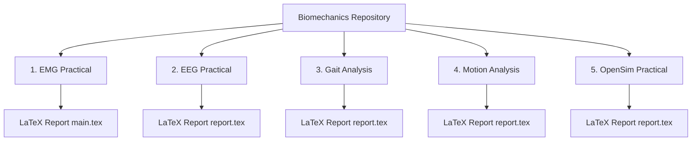

# Biomechanics Practical Reports & Biomedical Signal Analysis

A comprehensive repository containing practical laboratory reports, data processing scripts, and clinical signal analysis workflows across key biomechanics & electrophysiological domains.

---

## Repository Overview & Structure



---

## Practical Modules Breakdown

### 1. Electromyography (EMG) Practical
* **Focus:** Surface EMG acquisition, RMS moving window envelope extraction, MVC normalisation.
* **Key Files:**
  * Raw trial datasets (`emg_raw_trial_*.csv`)
  * Feature datasets (`emg_mvc_sliding_rms.csv`)
  * LaTeX report (`main.tex`, compiled `main.pdf`)

### 2. Electroencephalography (EEG) Practical
* **Focus:** Reference electrode montages (Ear Lobe vs. Thumb) and eye-blink EOG artifact propagation.
* **Key Files:**
  * HDF5 session dataset (`RecordSession_12026.09.28_09.39.53.hdf5`)
  * Standardized LaTeX report (`report.tex`)

### 3. Gait Analysis
* **Focus:** Lower limb kinematics, 2D/3D trajectory parsing, gait cycle event identification.
* **Key Files:**
  * Marker trajectories (`markers.csv`)
  * MATLAB analysis script (`gait230449N.m`)
  * LaTeX report (`report.tex`)

### 4. 3D Motion Analysis Practical
* **Focus:** 3D motion capture C3D binary parsing, kinematic derivatives, and web simulation.
* **Key Files:**
  * Binary C3D motion dataset (`Group2_2026.c3d`, `Motion2026.c3d`)
  * Spatial coordinate ASCII export (`Group2_2026_(Coordinates).txt`)
  * Interactive HTML simulator (`simulator.html`)
  * Standardized LaTeX report (`report.tex`)

### 5. OpenSim Practical (Crouch Gait & Muscle Kinematics)
* **Focus:** Musculoskeletal modeling in OpenSim 4.6, crouch gait knee kinematics, and semitendinosus muscle-tendon length evaluation.
* **Key Files:**
  * Kinematic comparative plot (`Crouch_Normal_knee_angles_r.png`)
  * Kinematic dataset (`gait.xlsx`)
  * Standardized LaTeX report (`report.tex`)

---

## Report Structure & Methodological Command Placeholders

All practical reports (`report.tex` / `main.tex`) share the standardized University of Moratuwa B.Sc. Engineering Biomechanics template format:
* **Title Page:** University logo (`campus_logo.png`), course metadata, student index (`230449N`), date.
* **Sections:** Introduction, Methods (with clear `<INSERT_..._COMMAND_HERE>` placeholders for automated CLI/script commands), Results, Discussion, and Conclusion.

---

## Compiling LaTeX Practical Reports

To compile any report, navigate to its directory and run `pdflatex`:

```bash
# 1. EMG Practical
cd "EMG practicle" && pdflatex main.tex

# 2. Gait Analysis
cd "../Gait Analysis" && pdflatex report.tex

# 3. EEG Practical
cd "../EEG practical" && pdflatex report.tex

# 4. Motion Analysis Practical
cd "../Motion analysis practicle" && pdflatex report.tex

# 5. OpenSim Practical
cd "../OpenSim practicle" && pdflatex report.tex
```
