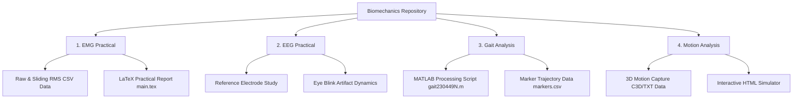
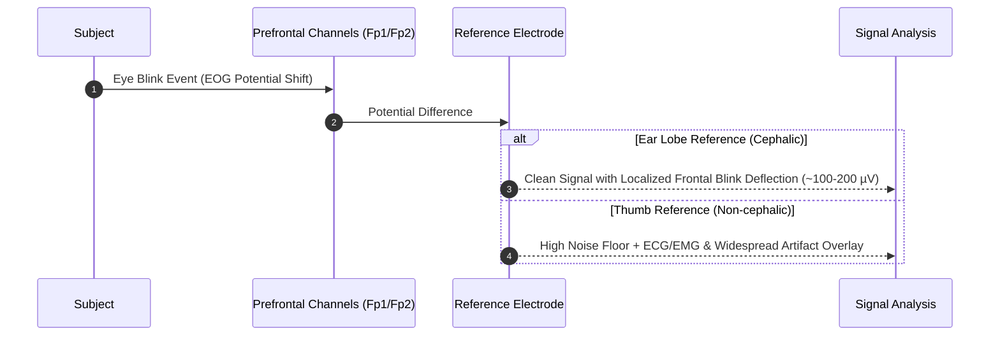
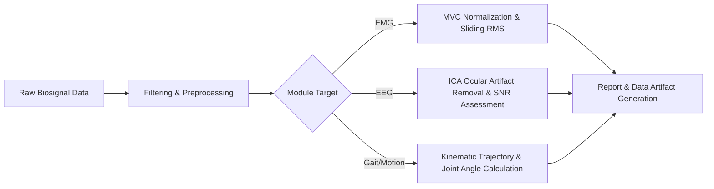

# Biomechanics Practical Reports & Biomedical Signal Analysis

A comprehensive repository containing practical laboratory reports, data processing scripts, and clinical signal analysis workflows across key biomechanics & electrophysiological domains.

---

## Repository Structure & Overview



---

## Modules Breakdown

### 1. Electromyography (EMG) Practical
* **Focus:** Muscle activation dynamics, Maximum Voluntary Contraction (MVC), and sliding RMS envelope calculation.
* **Key Files:**
  * Raw trial datasets (`emg_raw_trial_*.csv`)
  * Processed signal features (`emg_mvc_sliding_rms.csv`)
  * Full LaTeX practical report (`main.tex`, compiled `main.pdf`)

### 2. Electroencephalography (EEG) Practical
* **Focus:** Impact of reference electrode selection (**Ear Lobe** vs. non-cephalic **Left Thumb** & **Right Thumb**) on signal SNR and propagation of **Eye Blink Artifacts**.



### 3. Gait Analysis
* **Focus:** Lower limb kinematics and stride phase segmentation using optical motion capture marker tracking.
* **Key Files:**
  * Trajectory coordinates (`markers.csv`)
  * Analysis & visualization script (`gait230449N.m`)
  * Reference gait cycle presentation (`Gait Analysis - Reference Slides.pptx`)

### 4. Motion Analysis Practical
* **Focus:** 3D biomechanical motion reconstruction and interactive kinematics preview.
* **Key Files:**
  * Motion capture data files (`Group2_2026.c3d`, `Group2_2026_(Coordinates).txt`)
  * Visualization simulator (`simulator.html`)

---

## Signal Processing & Analysis Pipeline



---

## Getting Started

1. **LaTeX Compiling (EMG Report):**
   ```bash
   cd "EMG practicle"
   pdflatex main.tex
   ```
2. **Gait Kinematics (MATLAB):**
   Open `gait230449N.m` in MATLAB to plot trajectory data from `markers.csv`.
3. **Motion Simulator:**
   Open `Motion analysis practicle/simulator.html` in standard web browsers.
